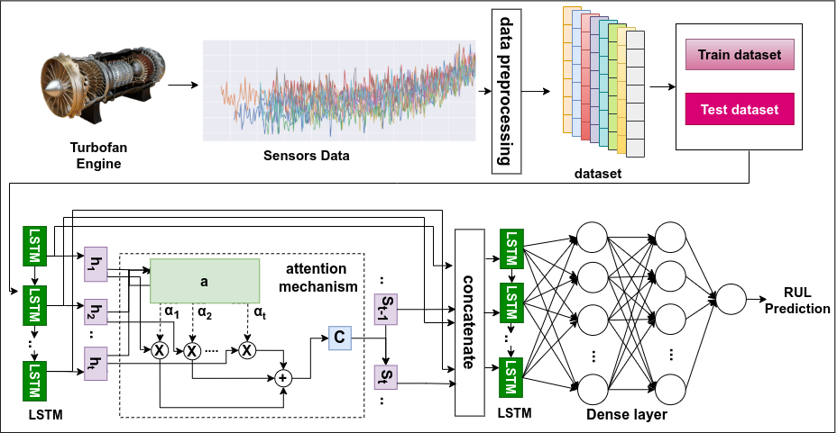
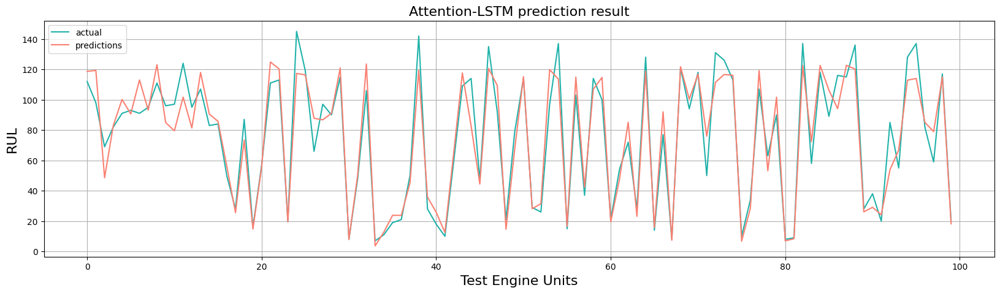
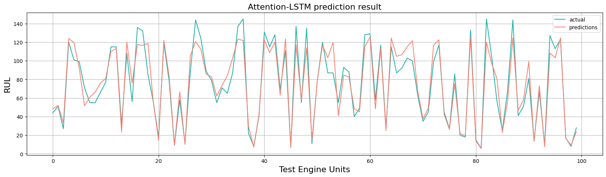
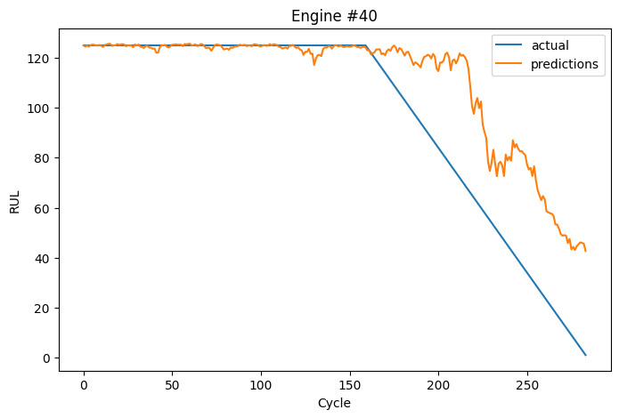
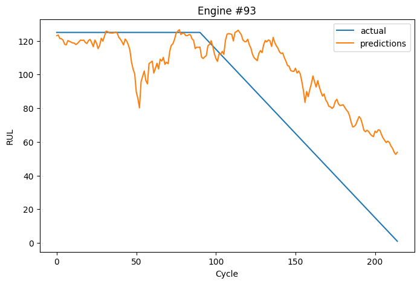

# Remaining Useful Life Prediction Using Attention-LSTM Neural Network of Aircraft Engine

** Abstract **
Accurate prediction of the Remaining Useful Life (RUL) is essential for the effective implementation of Prognostics and Health Management (PHM) in aerospace, particularly in enhancing aero-engine reliability and forecasting potential failures to reduce maintenance costs and human-related risks.

The NASA Commercial Modular Aero-Propulsion System Simulation (C-MAPSS) dataset, utilized in the 2021 PHM Data Challenge, serves as a widely recognized open-source benchmark, providing simulated turbofan engine data collected under realistic flight conditions. Previous deep learning approaches have leveraged this dataset to predict the remaining useful life of engine units.

However, data-driven methods for RUL prediction in aerospace often encounter challenges such as high model complexity, limited prediction accuracy, and reduced interpretability. To address these issues, this paper presents a novel hybrid framework that incorporates an attention mechanism to enhance aircraft engine RUL prognostics. Specifically, we employ a self-attention mechanism to effectively capture relationships and interactions among different features, enabling the transformation of high-dimensional feature spaces into \\lower-dimensional representations.

The proposed model, which integrates an LSTM network, demonstrates superior performance in predicting turbofan engine RUL. Experimental results validate its effectiveness, achieving RMSE values of 12.33 and 11.76, along with score values of 200 and 212 on the FD001 and FD003 sub-datasets, respectively. These results surpass those of other state-of-the-art methods on the C-MAPSS dataset.



# Results of Attention-LSTM

** The results of the RUL predictions for the C-MAPSS sub-dataset FD001 **



** The results of the RUL predictions for the C-MAPSS sub-dataset FD003 **



** Prediction of test engines FD001 **



** Prediction of test engines FD003 **



# Citation
```
@article{dida2025remaining,
  title={Remaining Useful Life Prediction Using Attention-LSTM Neural Network of Aircraft Engines},
  author={Dida, Marouane and Cheriet, Abdelhakim and Belhadj, Mourad},
  journal={International Journal of Prognostics and Health Management},
  volume={16},
  number={2},
  year={2025}
}

```
